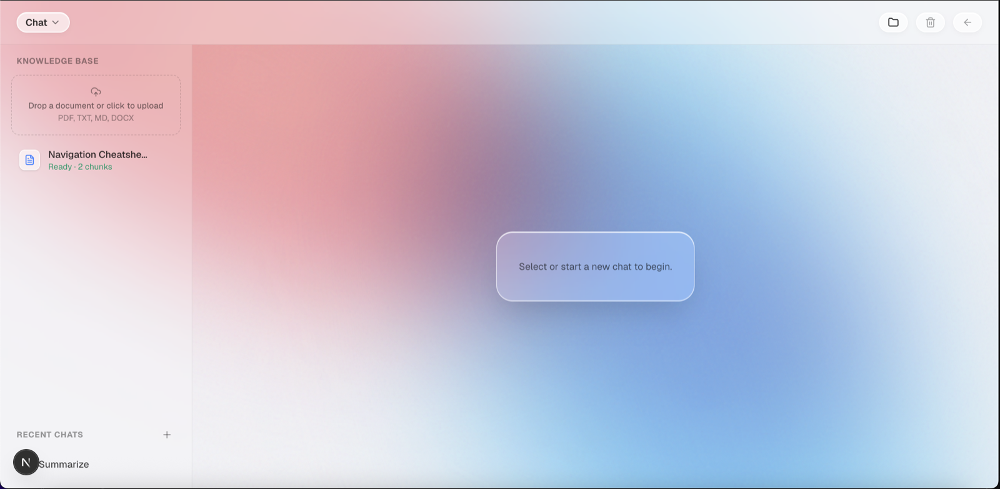
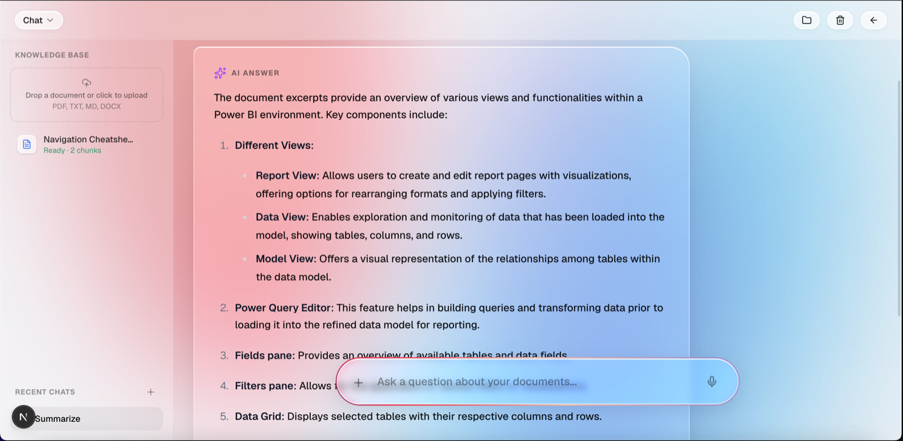
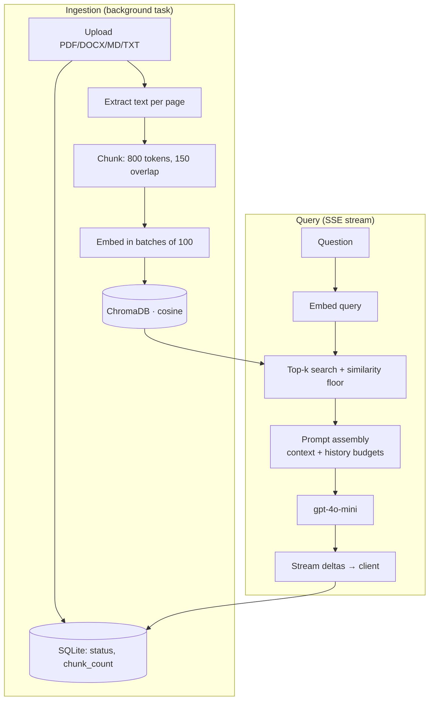

# RAG Chatbot

Ask questions against your own documents and get answers grounded in them, with inline citations back to the source file and page.

Upload a PDF, DOCX, Markdown, or text file and it's chunked, embedded, and indexed in the background. Ask a question and the relevant excerpts are retrieved, assembled into a token-budgeted prompt, and streamed back token-by-token over SSE. Answers cite the excerpts they used; when retrieval comes up empty, the model is instructed to say so rather than invent an answer.





## Stack

**Backend** — FastAPI · SQLAlchemy (SQLite) · ChromaDB · OpenAI (`gpt-4o-mini`, `text-embedding-3-small`) · tiktoken
**Frontend** — Next.js 16 (App Router) · React 19 · Tailwind CSS v4 · Zustand

## Architecture

Two pipelines share a document store: ingestion writes to it, retrieval reads from it.



State lives in two places, and they must agree: **SQLite** (`data/app.db`) holds sessions, messages, and document metadata; **ChromaDB** (`data/chroma/`) holds the vectors. Deleting a document removes its vectors, its upload, and its row.

## Quickstart

**Requires Python 3.13.** Python 3.14 fails to build `tiktoken`, `pydantic-core`, and `tokenizers` from source — the pinned versions have no 3.14 wheels and their Rust extensions don't compile against it. Node 20+ for the frontend.

### Backend

```bash
cd backend
python3.13 -m venv .venv && source .venv/bin/activate
pip install -r requirements.txt

cp .env.example .env        # then set OPENAI_API_KEY — the app won't start without it
uvicorn app.main:app --reload
```

Serves on `http://127.0.0.1:8000`. Interactive API docs at `/docs`. Tables are created on startup; no migration step.

### Frontend

```bash
cd frontend
npm install
npm run dev
```

Serves on `http://localhost:3000` and expects the backend at `http://127.0.0.1:8000` (override with `NEXT_PUBLIC_API_BASE_URL`).

## Configuration

All backend settings are environment variables, loaded from `backend/.env` via pydantic-settings.

| Variable | Default | Notes |
| --- | --- | --- |
| `OPENAI_API_KEY` | — | **Required.** Startup fails without it. |
| `OPENAI_CHAT_MODEL` | `gpt-4o-mini` | Generation model. |
| `OPENAI_EMBEDDING_MODEL` | `text-embedding-3-small` | Changing this invalidates existing vectors — re-index. |
| `CHROMA_PERSIST_DIR` | `./data/chroma` | Vector store location. |
| `SQLITE_DB_PATH` | `./data/app.db` | Relational store location. |
| `UPLOAD_DIR` | `./data/uploads` | Original files, kept for re-processing. |
| `CHUNK_SIZE_TOKENS` | `800` | Target chunk size, measured in tokens. |
| `CHUNK_OVERLAP_TOKENS` | `150` | Carried between chunks to avoid severing context at boundaries. |
| `RETRIEVAL_TOP_K` | `5` | Candidates fetched per query. |
| `RETRIEVAL_MIN_SIMILARITY` | `0.1` | Cosine floor; see the calibration note below. |
| `MAX_UPLOAD_SIZE_MB` | `25` | Rejected with a 400 above this. |
| `CORS_ORIGINS` | `http://localhost:3000` | Comma-separated. |

## How retrieval works

**Ingestion.** `POST /documents/upload` writes the file to `data/uploads/{uuid}{ext}`, inserts a `Document` row with `status="processing"`, and returns immediately — the work happens in a FastAPI background task. That task extracts text per page (`pypdf`, `python-docx`, or plain read), chunks it, embeds it, and writes to Chroma before flipping the row to `ready` (with `chunk_count`) or `failed` (with `error_message`). The UI polls document status every 2s while anything is processing.

**Chunking** (`services/chunking.py`) splits on paragraph boundaries first and packs paragraphs up to the token budget, rather than cutting blindly at a character count. Paragraphs larger than the budget are split with overlap. Sizes are measured with `tiktoken` (`cl100k_base`), so the budget reflects what the model actually consumes. Page numbers ride along on each chunk, which is what makes `[filename, p.N]` citations possible.

**Query.** The question is embedded, Chroma returns the top-k by cosine similarity, and anything below `RETRIEVAL_MIN_SIMILARITY` is dropped — a query with no good matches produces no context rather than irrelevant context.

**Prompt assembly** (`services/prompt.py`) enforces two independent budgets: **4000 tokens** of retrieved context and **2000 tokens** of conversation history. Both trim by *measured token count*, not message or chunk count, so a single long document excerpt can't silently push the history out of the window. History is trimmed oldest-first; context is trimmed lowest-ranked-first.

**Streaming.** Deltas are relayed to the client as they arrive. The assistant message is persisted only once the stream completes, so an interrupted generation doesn't leave a truncated answer in history.

## API

| Method | Path | Notes |
| --- | --- | --- |
| `GET` | `/health` | Liveness check. |
| `GET` | `/documents` | List documents, newest first. |
| `GET` | `/documents/{id}` | Fetch one (used for status polling). |
| `POST` | `/documents/upload` | Multipart. Validates extension and size, then ingests in the background. |
| `DELETE` | `/documents/{id}` | Removes vectors, the upload, and the row. |
| `GET` | `/sessions` | List sessions, most recently updated first. |
| `POST` | `/sessions` | Create a session. |
| `DELETE` | `/sessions/{id}` | Deletes the session and its messages. |
| `GET` | `/sessions/{id}/messages` | Full history, oldest first. |
| `POST` | `/sessions/{id}/messages` | Ask a question. Responds `text/event-stream`. |

Supported uploads: `.pdf`, `.txt`, `.md`, `.markdown`, `.docx`.

### SSE event shapes

`POST /sessions/{id}/messages` emits one event per token, then a terminal event:

```jsonc
{ "delta": "Power" }                                   // repeated, one per token
{ "done": true, "message_id": "…", "citations": [ … ] } // terminal: success
{ "error": "…" }                                        // terminal: failure
```

Each citation carries `document_id`, `filename`, `page_number` (nullable), and the rounded `similarity` — enough for the client to render and rank a source chip without a second request.

Optionally scope retrieval to specific documents by passing `document_ids` in the request body.

## Engineering notes

Two bugs from this repo's history that are worth knowing about, because neither is visible from the symptom:

**Retrieval silently returned nothing** ([`817a51f`](../../commit/817a51f)). Similarity was computed as `1 - distance`, which is only correct for cosine distance — but Chroma defaults to **L2**. Every score came out negative, so the similarity floor filtered out *every* result for *every* query, and the bot answered from no context at all while looking like it worked. Fixed by configuring the collection with `hnsw:space: "cosine"` explicitly, then recalibrating the threshold to `0.1` against measured scores: relevant queries landed around 0.16–0.28, irrelevant ones around 0.06.

**The glass UI never actually blurred** ([`da52ce6`](../../commit/da52ce6)). The CSS said `backdrop-filter: blur(48px)`, but Lightning CSS collapsed the declaration to `-webkit-backdrop-filter` alone, and current Chrome no longer supports that prefixed form — so it computed to `none` app-wide. It looked plausible in the source and in DevTools' style panel; only the rendered pixels gave it away. Routing through Tailwind's `@apply` keeps both the prefixed and standard properties in the output.

The theme is worth stating plainly: both bugs produced *confident, plausible-looking output that was wrong*, and neither was catchable by lint, type-checking, or reading the code.

## Project layout

```
backend/
  app/
    routers/      # HTTP surface: health, documents, chat
    services/     # ingestion, chunking, embeddings, vectorstore, retrieval, prompt, llm
      extractors/ # per-format text extraction, keyed by file extension
    models/       # SQLAlchemy tables
    schemas/      # Pydantic request/response models
  data/           # SQLite db, Chroma index, uploads (gitignored)
frontend/
  app/            # Next.js App Router entry + global styles
  components/     # chat, documents, sessions, layout
  lib/api/        # typed fetch wrappers + SSE client
  store/          # Zustand stores (chat, documents, sessions)
```

## Limitations & roadmap

Known gaps, stated plainly — this is a working prototype, not a hardened deployment.

- **No authentication.** Every endpoint is open. Anyone who can reach the API can read, upload, or delete any document or session. This is the first thing to fix before exposing it anywhere.
- **No migrations.** Tables come from `Base.metadata.create_all()` at startup. Any schema change means recreating the database — fine now, not fine with real data. Alembic is the answer.
- **No retry/backoff on OpenAI calls.** A transient 429 or network blip surfaces to the user as a raw error mid-stream.
- **No test suite.** `pytest` is a dependency but nothing uses it yet. The highest-value targets are chunking edge cases (empty pages, oversized paragraphs) and the extractors.
- **Two stores, no transaction.** SQLite and Chroma are kept consistent by application code; a crash between writes can leave them disagreeing.
- **In-process ingestion.** `BackgroundTasks` runs in the web process, so a restart mid-ingest strands a document in `processing` with no retry. A durable queue would fix both.
- **No stream cancellation.** Once generation starts there's no stop button.

Roadmap, roughly in order of value:

1. **Hybrid search** — BM25 alongside vector search. Pure embedding similarity reliably misses exact tokens like IDs, error codes, and acronyms.
2. **Reranking** — a cross-encoder pass over the top-k. Usually the largest quality gain per unit of effort once basic retrieval works.
3. **Eval harness** — a fixed question set scored for faithfulness and relevance, so retrieval changes stop being judged by vibes.
4. Retries with backoff, Alembic migrations, authentication, and Docker Compose for one-command setup.

## License

MIT — see [LICENSE](LICENSE).
